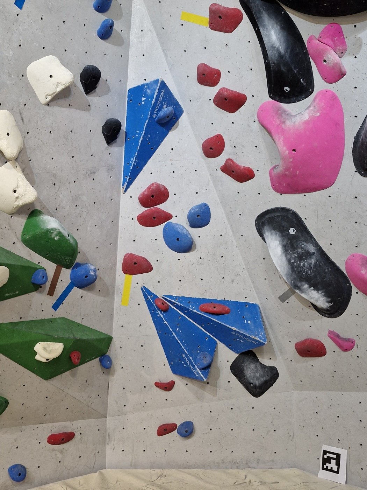
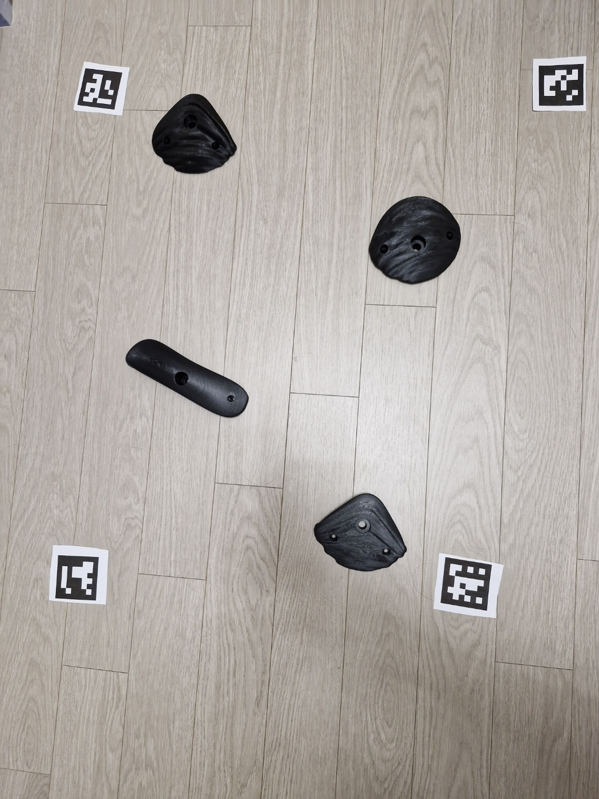
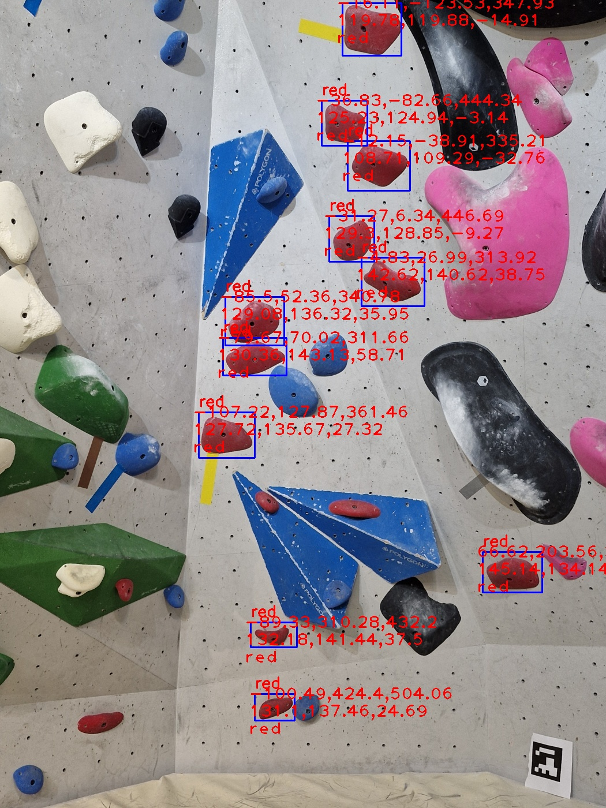

### 실행하기

#### 가상 환경 구성 및 필요 패키지 설치

파이썬 3.7 환경의 가상환경 구축하기:

    cd SmartClimbing_iot_capstone
    conda create -n env python=3.7
    conda activate env

필요한 패키지들을 설치

    pip install -r requirements.txt

#### 데모 실행하기

실행:

    python main.py

### Demo Image

#### Test Input

#### Processed Output

#### Graph Output

